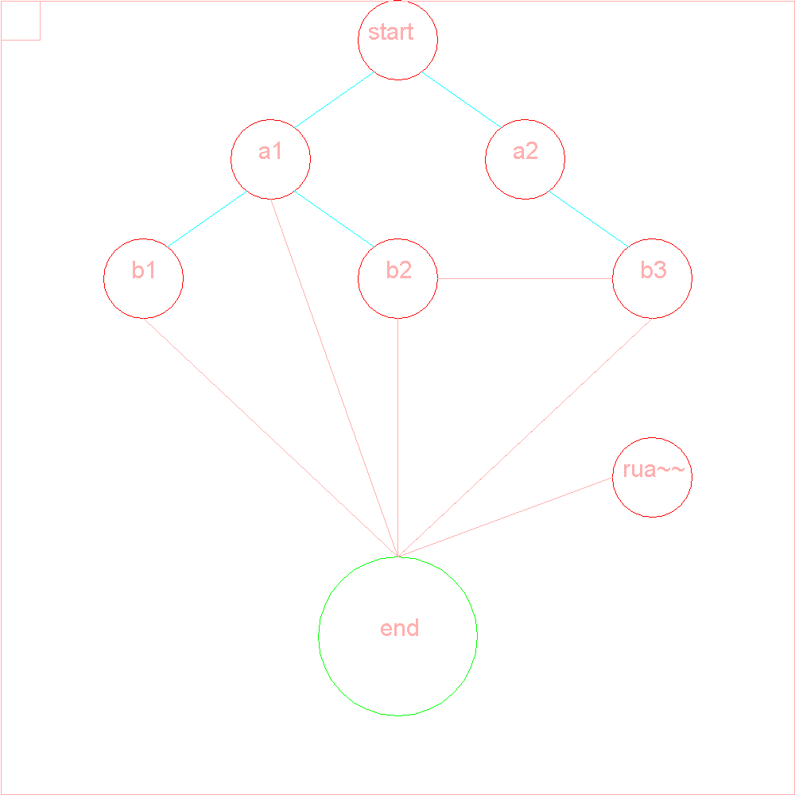
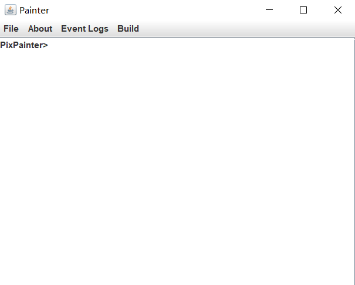

#PixPainter
Create by KKoishi_
###A Java picture drawer
The way to draw picture is input code in the terminal(Actually, it is JTextArea)

Also,it supports script file,like this(create an undirected-graph):


```pixScript
create 1000 1000 rua;
setFont null plain 30;
setcolor red;
drawcircle 500 50 50;drawcircle 340 200 50;
drawcircle 660 200 50;drawcircle 180 350 50;
drawcircle 500 350 50;
drawcircle 820 350 50;
drawcircle 820 600 50;
setColor green;
drawCircle 500 800 100;
setColor cyan;
draw -line 470 90 370 160;draw -line 530 90 630 160;
draw -line 310 240 210 310;draw -line 370 240 470 310;
draw -line 690 240 790 310;
setColOr Pink;
drawpline 5 180 400 500 700 500 400 500 700 340 250;
drawpline 4 500 700 820 400 500 700 770 600;
draw -line 550 350 770 350;
drawstring 500 50 start;
drawstring 340 200 a1;drawstring 660 200 a2;
drawstring 180 350 b1;drawstring 500 350 b2;
drawstring 820 350 b3;drawstring 820 600 rua~~;
drawstring 500 800 end;
draw -rect 1 1 999 999;
draw -rect 1 1 50 50;
export;
```
The way to run the script is input ```kShell [path]```
.And every single command need to be ended with ";".

Cautions:
* Some commands are not finished
* Now it only supports png format,maybe I will add more export format-supporting soon.
* You can use "list" to check all the commands.

##Display
